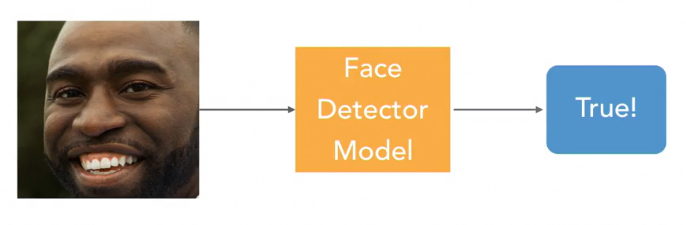
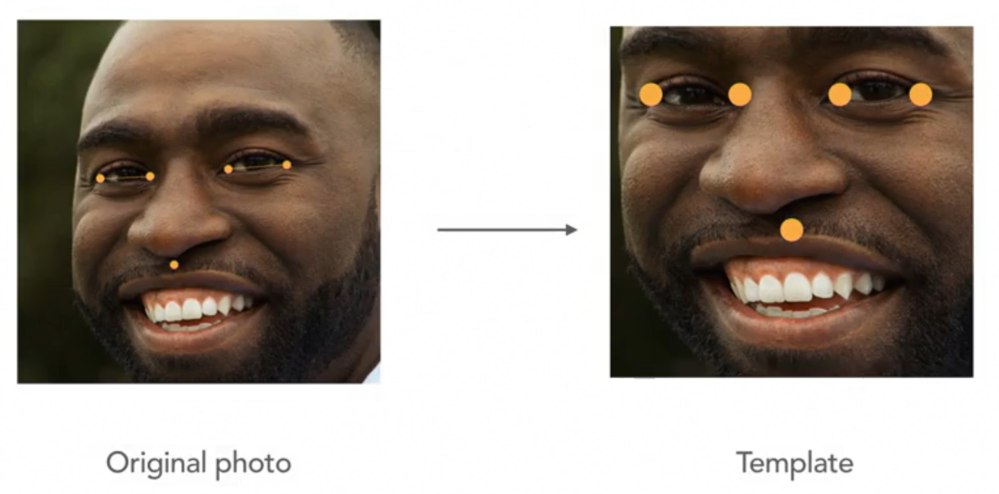
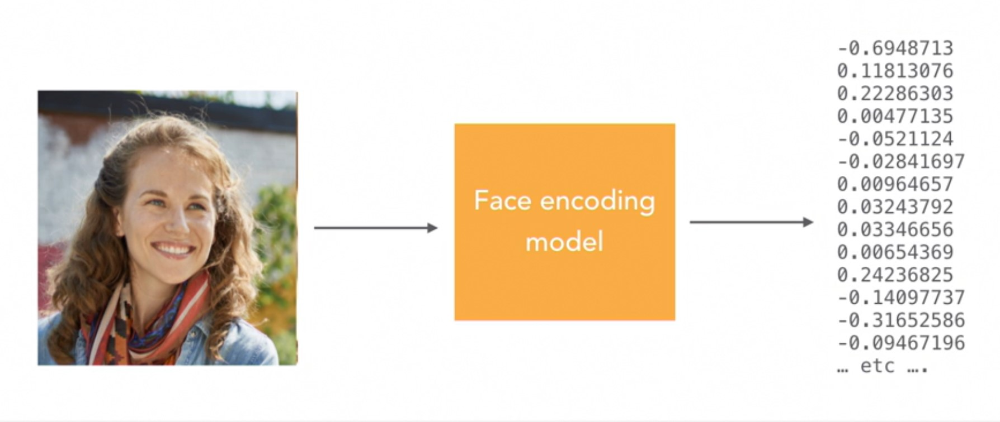

# Face Recognition

## Getting Started

- Clone this repo

```bash
# 1. Create python virtualenv; Skip if virtualenv exists
virtualenv .venv
# 2. Activate virtualenv
source .venv/bin/activate
cd face/
# 3. Install pip dependencies
pip install -r requirements.txt
# 4. Execute face recognition scripts
python 1.\ face_detection.py
python 2.\ face_landmarks.py
python 3.\ face_encodings.py
python 4.\ face_recognition_system.py
python 5.\ digital_makeup.py
python 6.\ face_similarity.py
```

## Overview

In this repo, we will explore the ability to recognize a person's face in a digital image. Recognizing a face is a complicated task that involves multiple steps:

- [Face detection](#face-detection): locate and extract faces
- [Facial feature detection](#facial-feature-detection): identify facial features and align faces with respect to pose
- [Face encoding](#face-encoding): represent faces as numerical measurements
- [Facial recognition](#facial-recognition): train machine learning models on facial measurements

---

## Face detection

The goal of face detection is to detect all faces within an image. One of the ways to implement face detection is with a sliding window classifier (SWC). SWC follows the following steps:

1. Build a face detector model which takes an image as input and outputs binary indicator whether face is detected



2. Slide face classifier model across subset windows of image to locate area of image that   capture faces


There are multiple face detection algorithms and there are 3 of them below.

| Algorithms | Description | Advantages | Disadvantages |
|------------|-------------|------------|---------------|
| Viola-Jones | Invented in early 2000s; use decision trees to detect faces based on light and dark areas | Very fast; great for low-powered devices | Not very accurate |
| Histogram of Oriented Gradients (HOG) | Invented in 2005; looks for patterns of shifts from light to dark areas in an image | Runs well on normal computer without special hardware; more accurate than Viola-Jones | Slower than Viola-Jones |
| Convolutional Neural Network (CNN) | Deep neural network to detect faces | Very accurate | Requires many training data; slow to train; run best on computer with GPUs |

## Facial feature detection

There are 2 steps within facial feature detection: **face landmark estimation** and **face alignment**. 

1. Face landmark estimation is the operation which finds the location of key points on a face, such as the tip of the nose and center of each eye. The goal of face landmark estimation is to reduce the pixels of faces to set of points which represent well known features on faces - which are similar for the majority of people. There are various types of facial landmark representations (e.g. 68-point facial landmark, 5-point facial landmark, etc.).


2. Face alignment is the adjustment of raw face images such that key facial features (likes the eyes, nose, and mouth) line up with a predefined template. It is proven that face alignment improves the overall performance of face recognition systems by correcting for head angle and rotation. This can be achieved by calculating **affine transformation** (a linear mapping between sets of points where parallel lines will remain parallel) from the original image to predefined template.



## Face encoding

Face encoding is the process of taking an image of a face and reducing it to a set of numerical features. The idea is to have numerical representations of faces such that one can quantitatively compare faces. Instead of engineering large number of features from facial landmarks, deep metric learning (which uses deep learning to perform feature engineering) is used to learn the facial features that best represent faces.



## Facial recognition

After applying face encoding to face images, the facial features can be used to quantitatively compare different face images. The logic goes as followed:

1. Assume there are 2 face images: _faceA_ and _faceB_
2. Define face distance threshold _T_
3. Apply face encoding for both _faceA_ and _faceB_, resulting in _encA_ and _encB_ respectively
4. Calculate euclidean distance _d_ between _encA_ and _encB_
5. Check whether _d_ is less than _T_. If it is, then _faceA_ and _faceB_ are considered a match. If _d_ is **greater** than _T_, then _faceA_ and _faceB_ are **not** considered a match.
